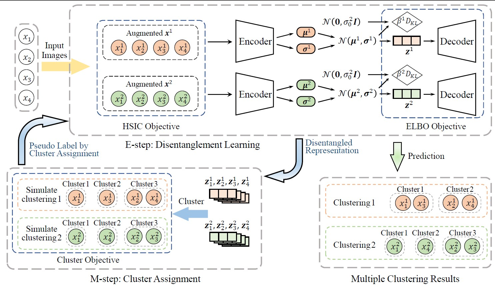

## Dual-disentangled Deep Multiple Clustering

Official PyTorch implementation for the SDM 2024 paper.

Jiawei Yao, [Juhua Hu](http://faculty.washington.edu/juhuah/)*

Abstract: Multiple clustering has gathered significant attention in recent years due to its potential to reveal multiple hidden structures of the data from different perspectives. Most of multiple clustering methods first derive feature representations by controlling the dissimilarity among them, subsequently employing traditional clustering methods (e.g., k-means) to achieve the final multiple clustering outcomes. However, the learned feature representations can exhibit a weak relevance to the ultimate goal of distinct clustering. Moreover, these features are often not explicitly learned for the purpose of clustering. Therefore, in this paper, we propose a novel Dual-Disentangled deep Multiple Clustering method named DDMC by learning disentangled representations. Specifically, DDMC is achieved by a variational Expectation-Maximization (EM) framework. In the E-step, the disentanglement learning module employs coarse-grained and fine-grained disentangled representations to obtain a more diverse set of latent factors from the data. In the M-step, the cluster assignment module utilizes a cluster objective function to augment the effectiveness of the cluster output. Our extensive experiments demonstrate that DDMC consistently outperforms state-of-the-art methods across seven commonly used tasks.


## Method
|  | 
|:--:| 
| ***Overall framework of DDMC**. DDMC trains disentanglement learning and cluster assignment in an EM framework. During the E-step, the disentangled representation is learned through both coarse-grained and fine-grained disentangled representation learning. The learned disentangled representations can be applied to multiple clustering tasks. In the M-step, cluster assignment is optimized, enhancing the cluster-level performance.* |


## Requirements
 - We recommend Linux for performance and compatibility reasons.
 - 1 NVIDIA GPUs. We developed and trained the model using RTX 2080 Ti (11GB).
 - PyTorch >= 1.11


## Getting started
### Datasets
- [x] Furit 
- [x] Furit360
- [x] Cards

Please refer to http://faculty.washington.edu/juhuah/images/AugDMC_datasets.zip


### Training and evaluation
Fruit dataset
```
python main.py --dataset fruit --lr 0.01 --weight_decay 0.00005
```

Fruit360 dataset
```
python main.py --dataset fruit360 --lr 0.03 --weight_decay 0.0001
```

Cards dataset
```
python main.py --dataset cards --lr 0.01 --weight_decay 0.00005
```
## Bibtex
Please cite our paper if you use this code in your own work:

```

```

## Acknowledgement
This research is supported in part by Advata Gift funding. All opinions, findings, conclusions and recommendations in this paper are those of the author and do not necessarily reflect the views of the funding agencies.
